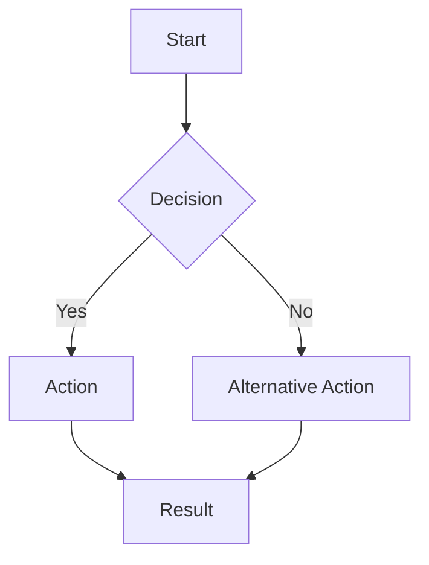
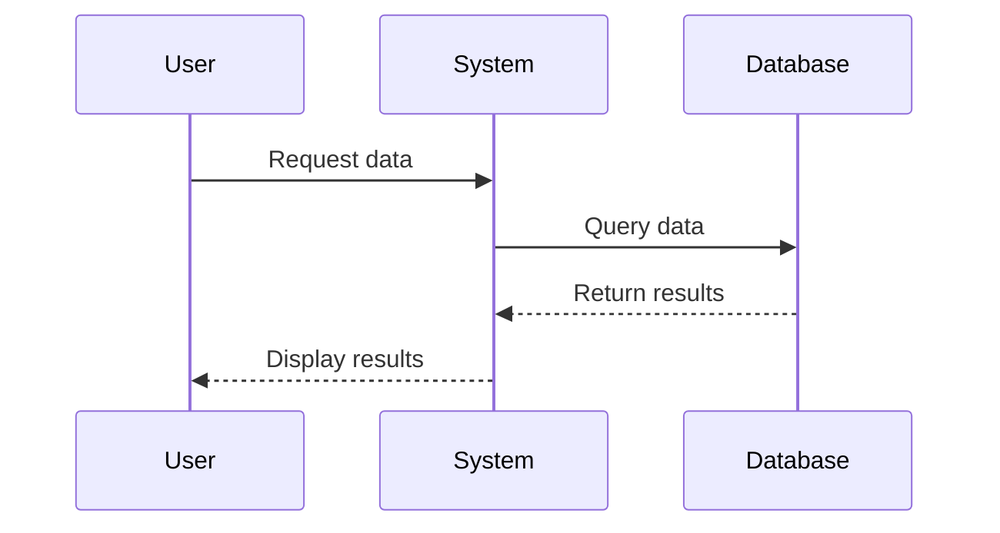
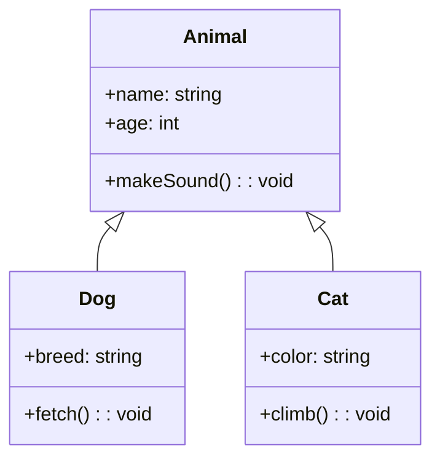

  
  <h1>Mermaid Diagram Creator</h1>
  
<strong>Create beautiful diagrams using text and AI - instantly visualized</strong>

  

    <a href="https://text-to-mermaid-diagram-generator.up.railway.app/">View Demo</a>
    ·
    <a href="https://github.com/jeevanba273/ai-based-text-to-mermaid-diagram-generator/issues">Report Bug</a>
    ·
    <a href="https://github.com/jeevanba273/ai-based-text-to-mermaid-diagram-generator/issues">Request Feature</a>
  

## 🚀 Live Demo

Check out the live application at [**Mermaid Diagram Generator App**](https://text-to-mermaid-diagram-generator.up.railway.app/)

## ✨ Features

- **Real-time Preview** - See your diagrams come to life as you type
- **AI-Powered Generation** - Create diagrams using natural language with GPT-4o-mini
- **Multiple Export Options** - Save your diagrams as SVG, PNG, JPG, or JPEG
- **Dark/Light Mode** - Work comfortably in any lighting condition
- **Responsive Design** - Works on desktop and mobile devices

## 🧠 How It Works

Mermaid Diagram Creator converts text in the [Mermaid syntax](https://mermaid.js.org/intro/) into visual diagrams in real-time. You can either:

1. **Write directly in Mermaid syntax** - If you're familiar with the syntax, write your diagram code directly
2. **Use AI to generate diagrams** - Describe what you want in natural language, and the AI will create the diagram for you

### Mermaid Syntax Examples

Flow Chart

Sequence Diagram

Class Diagram

## 🛠️ Using the Application

### Creating a Diagram

1. **Code Editor Method**:
   - Select the "Mermaid Code" tab
   - Type or paste your Mermaid syntax
   - See the preview update in real-time

2. **AI Generation Method**:
   - Select the "AI Prompt" tab
   - Type a description of the diagram you want to create
   - Click "Generate" (requires OpenAI API key)
   - Watch as the AI creates the diagram for you

### Setting Up Your OpenAI API Key

1. Click the gear icon next to the "Generate" button
2. Enter your OpenAI API key
3. Your API key is stored locally in your browser and is never sent to our servers

### Exporting Your Diagram

1. Click the "Export" button in the top right corner
2. Select your preferred format:
   - SVG (vector graphics, best for quality)
   - PNG (transparent background)
   - JPG/JPEG (with white background)
3. The diagram will download automatically

### Toggling Light/Dark Mode

- Click the sun/moon icon in the top right corner to switch between light and dark modes

## 💻 Technical Details

### Built With

- [React](https://reactjs.org/) - UI Framework
- [TypeScript](https://www.typescriptlang.org/) - Type Safety
- [Tailwind CSS](https://tailwindcss.com/) - Styling
- [shadcn/ui](https://ui.shadcn.com/) - UI Components
- [Mermaid.js](https://mermaid.js.org/) - Diagram Rendering Engine
- [OpenAI API](https://openai.com/api/) - AI Diagram Generation
- [Vite](https://vitejs.dev/) - Build Tool

### Architecture

The application consists of several key components:

- **Editor Component**: Provides tabs for both Mermaid code and AI prompt inputs
- **Preview Component**: Renders the Mermaid syntax into visual diagrams
- **AIPrompt Component**: Handles interaction with the OpenAI API
- **Export Functionality**: Converts diagrams to various image formats

## 🔒 Privacy & Security

- Your diagrams and code stay in your browser
- OpenAI API keys are stored only in your local browser storage
- No data is sent to our servers except when using the AI generation feature

## 🚀 Deployment

The application is deployed on [Railway.app](https://railway.app/), a modern cloud platform that makes it easy to deploy web applications.

## 🔍 Future Enhancements

- Save diagrams to your account
- Share diagrams with others
- More diagram types and templates

---

  Built with ❤️ using React, TypeScript, and the power of AI

